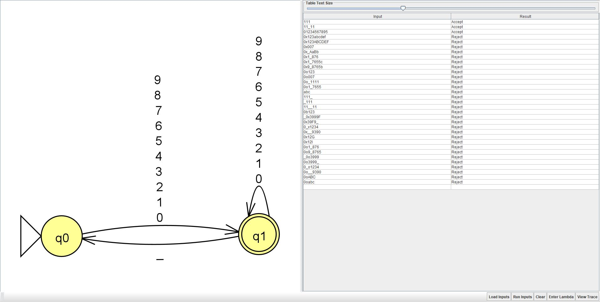

# 🧮 TypeStrong Group Project

**Course:** CS 3110  
**Project:** Accept or Reject Python Numerical Literals  
**Goal:** Implement a program that recognizes and validates Python numerical literals as a hands-on application of programming language concepts.

---

## 👥 Team Members
- **Anton Clark**
- **Angelica Ballin**

---

## ✅ Tasks Completed

### 1. Recognize Python Decimal Integers  

🔗 [View File](https://github.com/Antonc15/TypeStrong-GroupProject/blob/main/decInt.py)  
- **Anton Clark:**  
- **Angelica Ballin:**  

---

### 2. Recognize Python Octal and Hexadecimal Integers  
🔗 [View File](#)  
- **Anton Clark:**  
- **Angelica Ballin:**  

---

### 3. Recognize Python Floating Point Literals  
🔗 [View File](#)  
- **Anton Clark:**  
- **Angelica Ballin:**  

---

📘 *Each member contributed to understanding, coding, and testing the recognition of Python numerical literals.*
