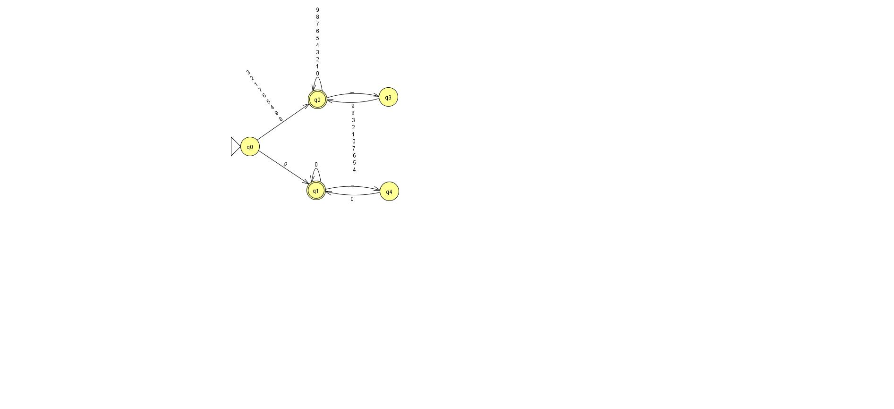
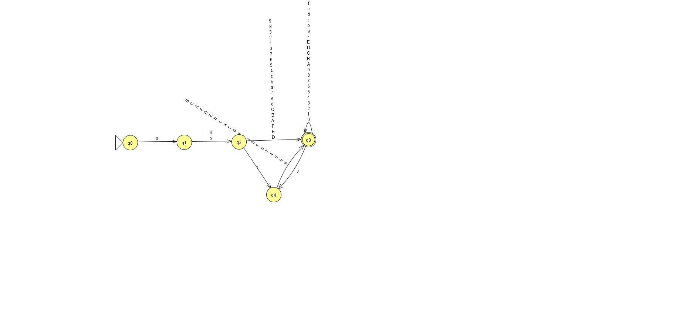
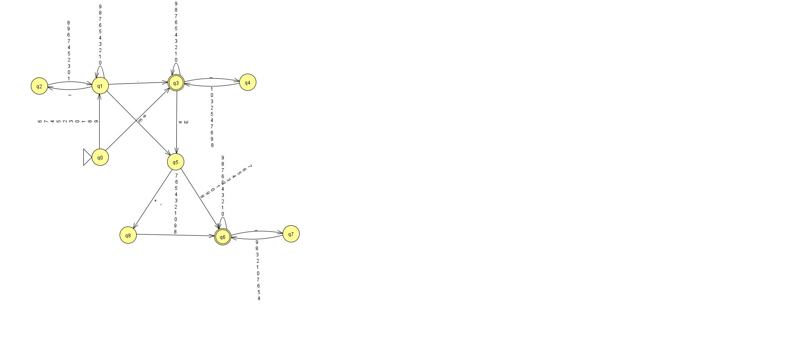

# 🧮 TypeStrong Group Project

**Course:** CS 3110  
**Project:** Accept or Reject Python Numerical Literals  
**Goal:** Implement a program that recognizes and validates Python numerical literals as a hands-on application of programming language concepts.

---

## 👥 Team Members
- **Anton Clark**
- **Angelica Ballin**

---

## ✅ Tasks Completed

### 1. Recognize Python Decimal Integers (Accepts 0 integers)

🔗 [View File](https://github.com/Antonc15/TypeStrong-GroupProject/blob/main/decInt.py)  
- **Anton Clark:**
- ✕
- **Angelica Ballin:**  
- Fully implemented. 
---

### 2. Recognize Python Octal and Hexadecimal Integers  

🔗 [View File Octal](https://github.com/Antonc15/TypeStrong-GroupProject/blob/main/octInt.py)  
🔗 [View File Hexadecimal](https://github.com/Antonc15/TypeStrong-GroupProject/blob/main/hexInt.py)  
- **Anton Clark:**
- Wrote .java script for the Octal / Hexadecimal parsing
- Translated the three script to python
- **Angelica Ballin:**  
- ✕

### 3. Recognize Python Floating Point Literals

🔗 [View File](https://github.com/Antonc15/TypeStrong-GroupProject/blob/main/float.py)  
- **Anton Clark:**
- - ✕
- **Angelica Ballin:**  
- Fully implemented.

---

📘 *Each member contributed to understanding, coding, and testing the recognition of Python numerical literals.*
